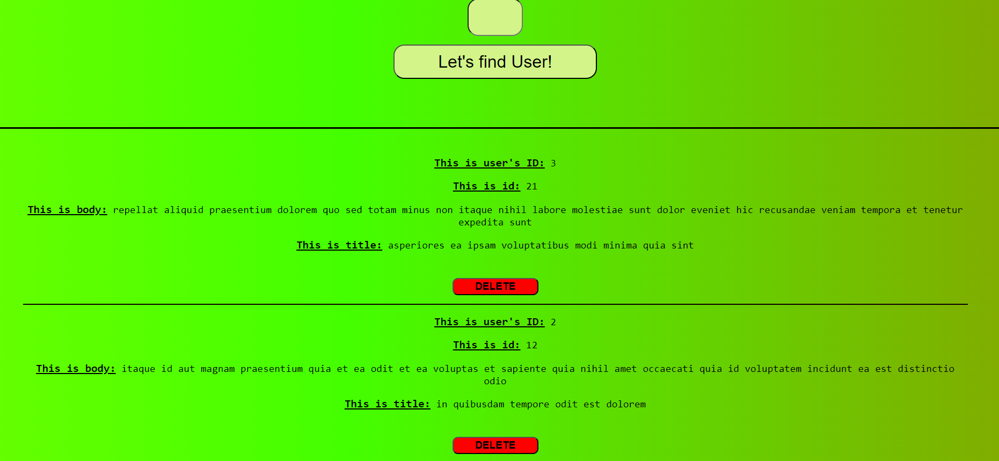

Projekat: FfetchingAPI
Ovaj projekat koristi JSON Placeholder API za dohvat tipskih podataka. Nakon što se podaci dohvate, oni se spremaju u local storage i prikazuju u listi na korisničkom interfejsu. Ključne funkcionalnosti projekta uključuju:

Dohvat podataka: Unosom ID broja u input polje, API dohvaća podatke vezane za taj ID.
Prikaz podataka: Podaci se prikazuju u listi koja sadrži informacije o korisnicima.
Brisanje elemenata: Svaki element na listi ima dugme za brisanje, koje omogućava uklanjanje tog elementa sa liste.

Kako koristiti:

Unesite željeni ID u input polje.
Podaci će biti dohvaćeni sa API-ja, sacuvani u local storage i  prikazani na ekranu.
Klikom na dugme za brisanje možete ukloniti pojedinačne elemente iz liste.

